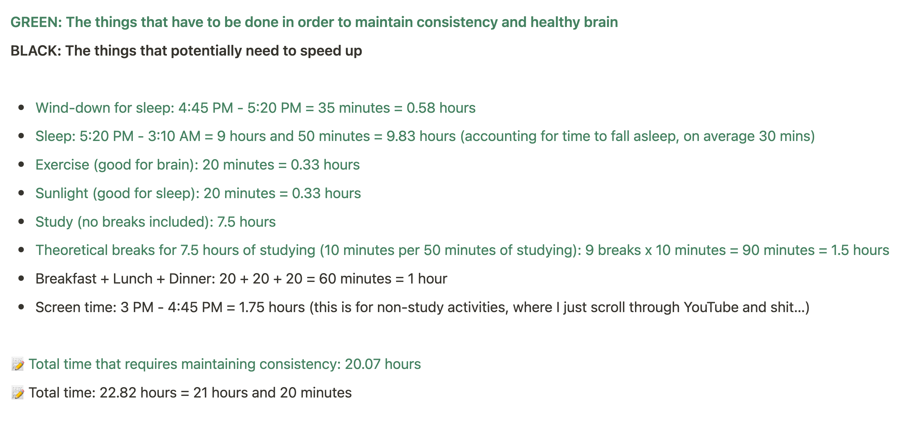

### Hi there 👋

Last month, I spent [200 hours](https://i.imgur.com/YNhZBEo.png) (**no breaks included**) to studying consistently from 4:00 AM to 3:00 PM.

<!--  -->

I stream daily on Twitch: [twitch.tv/xrsrke](https://www.twitch.tv/xrsrke) 

Currently, I'm breaking down the implementation of model parallelism in Megatron-LM and GPT-NeoX, and pipeline paralleism in [TorchGPipe](https://github.com/kakaobrain/torchgpipe). I am also working on reimplementing the Zero Redundancy Optimizer and building [an ML pipeline](https://twitter.com/xariusrke/status/1645347102342672384), and learning about [mechanistic interpretability](https://twitter.com/xariusrke/status/1630503779220226053).

Best way to reach me is discord: neuralink, [twitter/@xariusrke](https://twitter.com/xariusrke) or hello[@]xrs.wtf

<!-- 
I am interested in particle physics, deep learning, neuroscience, material science, nanoscience, astrophysics and synthetic biology. I have designed my curriculum and study from 4:00 AM to 3:00 PM to get the information into my brain. Last month, I spent [200 hours](https://i.imgur.com/YNhZBEo.png) (no breaks included) studying consistently (365/365).
 -->

<!-- **Building from scratch**
1. 🤖 REPAIRED: Replay-Guided Adversarial Environment Design [[code]](https://github.com/xrsrke/repaired) [[paper]]([https://arxiv.org/abs/2302.04761](https://arxiv.org/abs/2110.02439)) [[learning progress]](https://twitter.com/xariusrke/status/1630503779220226053)
2. 🧠 Decoding neural activity into text [[code]](https://github.com/xrsrke/neuraltext) [[paper]](https://www.nature.com/articles/s41586-021-03506-2#data-availability) [[learning progress]](https://twitter.com/xariusrke/status/1621403313651728386)
3. 🧬  Generating new proteins using language model [[code]](https://github.com/xrsrke/progen) [[paper]](https://www.nature.com/articles/s41587-022-01618-2) [[learning progress]](https://twitter.com/xariusrke/status/1621403313651728386)
4. 💥 Predicting behavior of quantum object using deep learning [[code]](https://github.com/xrsrke/paulinet) [[paper]](https://arxiv.org/abs/1909.08423) [[learning progress]](https://twitter.com/xariusrke/status/1617054608496693249)
 -->
<!--

Currently, I'm working on re-implement Stable Diffusion, [MuZero](https://github.com/xrsrke/muzero), [RLHF](https://github.com/xrsrke/instructGOOSE), [PauliNet](https://github.com/xrsrke/paulinet) from scratch. Most of my work just get started and in progress. So stay tuned!!
Feel free to check them out on my github.

**xrsrke/xrsrke** is a ✨ _special_ ✨ repository because its `README.md` (this file) appears on your GitHub profile.

Here are some ideas to get you started:

- 🔭 I’m currently working on ...
- 🌱 I’m currently learning ...
- 👯 I’m looking to collaborate on ...
- 🤔 I’m looking for help with ...
- 💬 Ask me about ...
- 📫 How to reach me: ...
- 😄 Pronouns: ...
- ⚡ Fun fact: ...
-->
